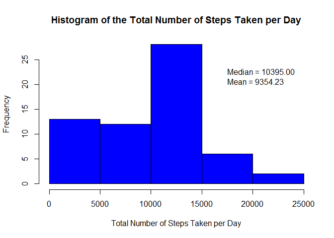
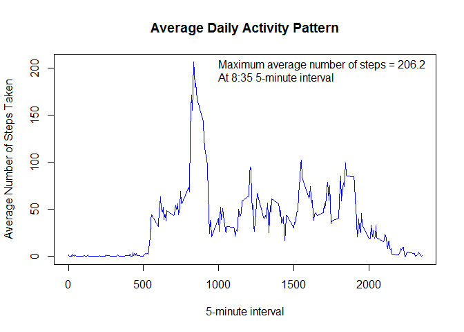
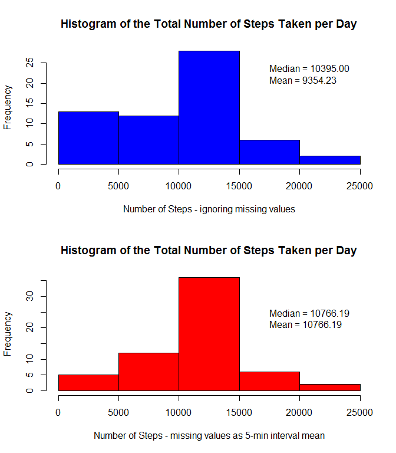
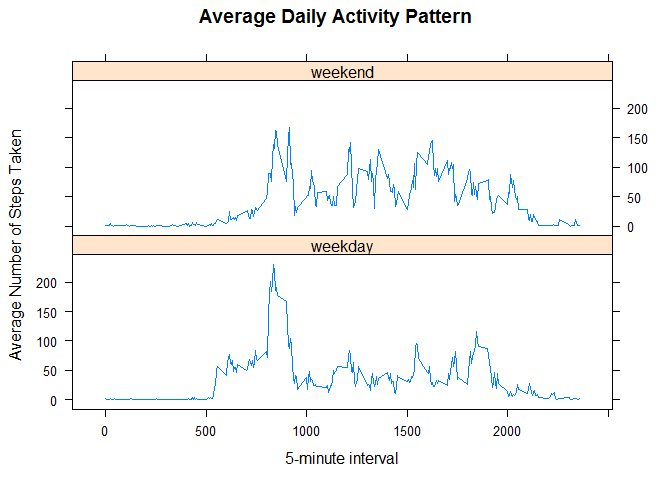

# Reproducible Research: Peer Assessment 1

##Introduction
**Data:** Activity Monitoring Data

**Prerequisits:**

1. The GitHub repository with the project info has been forked and cloned into the current directory (and therefore the dataset is available locally)

2. The package dplyr is installed

3. The package lattice is installed


## Loading and preprocessing the data
Set work directory as the forked/cloned project directory; unzip file; read it; convert date from factor to date

```r
unzip("activity.zip", overwrite = T)
activity <- read.csv("activity.csv", header = TRUE)
activity$date <- as.Date(activity$date, format = "%Y-%m-%d")
```


## What is mean total number of steps taken per day?
Sum up steps per day (removing NA); calculate mean and median; plot histogram; add mean and median value to the plot

```r
stepperday <- tapply(activity$steps, activity$date, sum, na.rm = TRUE)
meansteps <- mean(stepperday)
mediansteps <- median(stepperday)

hist(stepperday, col = "blue", 
     main = paste("Histogram of the Total Number of Steps Taken per Day"), 
     xlab = "Total Number of Steps Taken per Day")
text(17500, 20, sprintf("Mean = %.2f", meansteps), adj = c(0,0))
text(17500, 20, sprintf("Median = %.2f", mediansteps), adj = c(0,-1.5))
```

 

The mean total number of steps taken per day is 9354.23.
The median total number of steps taken per day is 10395.


## What is the average daily activity pattern?
Average steps per 5-min interval (removing NA); calculate maximum;
plot timeline; add maximum number of steps value to the plot


```r
steppermin <- tapply(activity$steps, activity$interval, mean, na.rm = TRUE)
topstep <- max(steppermin)
topmin <- names(steppermin[match(topstep,steppermin)])
ttopmin <- sprintf("%s:%s", substr((topmin),1,nchar(topmin)-2), substr((topmin),nchar(topmin)-1, nchar(topmin)))
plot(names(steppermin), steppermin, type = "l", col = "blue", main = "Average Daily Activity Pattern", xlab = "5-minute interval", ylab = "Average Number of Steps Taken")
text(1000, 200, sprintf("Maximum average number of steps = %.1f",topstep), adj = c(0,0))
text(1000, 200, sprintf("At %s 5-minute interval", ttopmin), adj = c(0,1.5))
```

 

The maximum number of average steps is at the **8:35** 5-minutes interval totalling 206.1698113 steps on average.


## Imputing missing values
**Use the mean for the 5-minute interval calculated previsously for filling missing values**

Create a matrix with interval and mean; create another matrix with the index of the original data set (to be used later for ordering), interval, and an identifier of missing value 


```r
steppermin <- cbind(interval = as.integer(names(steppermin)), Mean = steppermin)
stepna <- cbind(originseq = seq_along(activity$interval), 
                interval = activity$interval, isna = is.na(activity$steps))
```

Combine both matrix; re-order the final matrix; then create a variable with the value to be added to the original steps (Note: if value is not missing (isna equals 0) the fill value to be added is 0)


```r
filling <- merge(stepna, steppermin, by = "interval", all.x = TRUE)
filling <- filling[sort.list(filling$originseq),]
filling$fill <- filling$isna * filling$Mean
```

Create a new dataset that is equal to the original one; replace missing values by 0 (otherwise the addition will be NA); add the new variable with the value to be added to the original number of steps (Note: if number of steps was not a missing value, the value added is 0 - so no impact)


```r
filledactivity <- activity
filledactivity$steps[is.na(filledactivity$steps)] <- 0
filledactivity$steps <- filledactivity$steps + filling$fill
```

Manipulate the new dataset in a similar way the original dataset was maniputated. In other words, sum up steps per day (no NAs anymore); calculate mean and median; 


```r
fillstepperday <- tapply(filledactivity$steps, filledactivity$date, sum)
fillmeansteps <- mean(fillstepperday)
fillmediansteps <- median(fillstepperday)
```

Plot histogram for original dataset and new dataset together; add mean and median values to both


```r
par(mfrow=c(2,1))
hist(stepperday, col = "blue", main = "Histogram of the Total Number of Steps Taken per Day", xlab = "Number of Steps - ignoring missing values")
text(17500, 20, sprintf("Mean = %.2f", meansteps), adj = c(0,0))
text(17500, 20, sprintf("Median = %.2f", mediansteps), adj = c(0,-1.5))

hist(fillstepperday, col = "red", main = "Histogram of the Total Number of Steps Taken per Day", xlab = "Number of Steps - missing values as 5-min interval mean")
text(17500, 20, sprintf("Mean = %.2f", fillmeansteps), adj = c(0,0))
text(17500, 20, sprintf("Median = %.2f", fillmediansteps), adj = c(0,-1.5))
```

 


Calculate number of missing values; evaluate their impact on the result 


```r
nas <- sum(stepna[,"isna"])
nasp <- nas/nrow(stepna)*100
```

As 13% of the reported data was missing value (2304 out of 17568) and was replaced by the mean, the total number of steps taken per day increased as well as the mean (from 9354.23 to 10766.19) and median (from 10395 to 10766.19).


## Are there differences in activity patterns between weekdays and weekends?
Create a variable to identify the day of the week (format %u = 1 - 7, Monday is 1); set Sat and Sun (i.e. 6 and 7) to weekend and Mon to Fri (i.e. 1 to 5) to weekday; finally create a new variable as factor wihtin the new dataset


```r
dayweek <- format(filledactivity[ , "date"], "%u")
dayweek[dayweek >= 6] <- "weekend"
dayweek[dayweek < 6] <- "weekday"
filledactivity$dayofweek <- as.factor(dayweek)
```

Load dplyr library; group data by the day of the week (i.e. weekday or weekend) and interval; finally, summarize the mean number of steps of the grouped data


```r
library(dplyr)
```

```
## Warning: package 'dplyr' was built under R version 3.2.2
```

```
## 
## Attaching package: 'dplyr'
## 
## The following objects are masked from 'package:stats':
## 
##     filter, lag
## 
## The following objects are masked from 'package:base':
## 
##     intersect, setdiff, setequal, union
```

```r
DayweekInterval <- group_by(filledactivity, dayofweek, interval)
stepperminDayWeek <- summarize(DayweekInterval, tsteps = mean(steps))
```


Load lattice library; plots the mean number of steps by interval in two panels (weekday and weekend) 

```r
library(lattice)
xyplot(tsteps ~ interval | dayofweek, data = stepperminDayWeek, type = "l", 
       main = "Average Daily Activity Pattern", xlab = "5-minute interval", 
       ylab = "Average Number of Steps Taken", layout = c(1, 2))
```

 

As displayed, while the peak average number of steps is during weekdays, weekends have more intervals with higher number of steps (i.e. more peaks).
